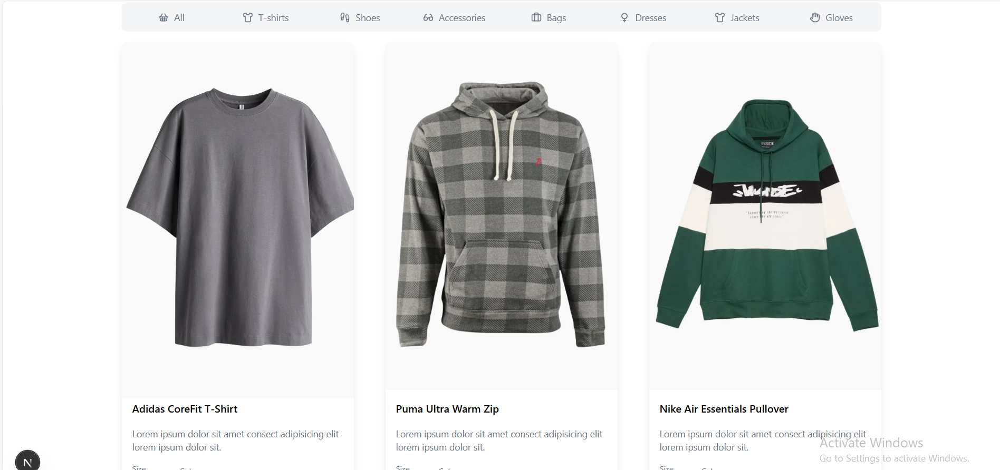
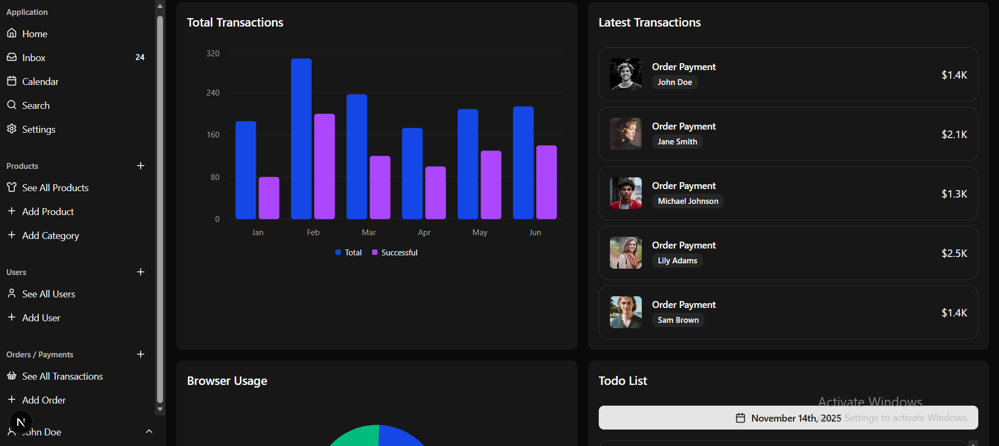

# 🚀 Next.js E-Commerce App & Admin Panel UI

A modern **E-Commerce frontend** built with **Next.js**, featuring both **Client UI** and **Admin Dashboard UI**.  
This project represents the **frontend of my Microservices E-Commerce Application**.

##  Features
- Beautiful and responsive shopping UI
- Admin panel for managing products, categories, orders
- Modern components with Tailwind CSS
- Clean architecture and reusable UI components

---

##  Client Interface

##  Admin Dashboard

---

## Tech Stack
- **Next.js**
- **React**
- **Tailwind CSS**

---

